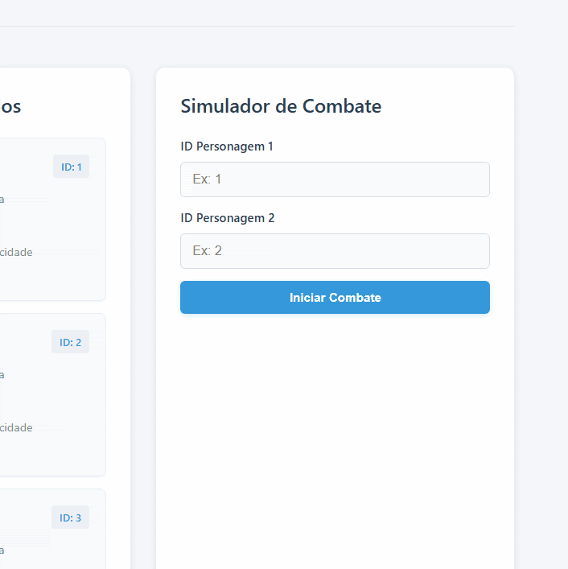
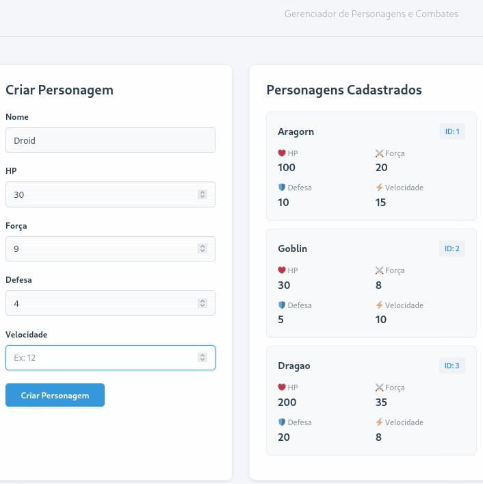

# RPG Engine — Backend Web com Haskell + Scotty
## 1. Identificação

- Nome: Bernardo Rizzardi Barbosa
- Curso: Sistemas de Informação
---

## 2. Tema/objetivo

O tema do trabalho é uma engine de combate de RPG por turnos, funcionando com cadastro de personagens, sendo possível designar atributos como força, HP, velocidade e defesa. A lógica principal é simular batalhas entre os personagens salvos na aplicação, relatando a batalha por turnos.

O trabalho aplica programação funcional por meio da lógica implementada em funções puras de Haskell (separadas do Scotty), recursão, para "substituir" ciclos de repetição, e pattern matching, na busca dos personagens, comparando não valores, mas o padrão entre as estruturas de dados.

---

## 3. Processo de desenvolvimento

A ideia inicial era fazer um sistema de combate simples entre personagens. Ao discutir o tema com a IA, surgiram variações como a temática de RPG, com sistema de HP, defesa, etc... Ela também me sugeriu outros 2 temas: um sistema de flashcards e outro de uma API de analise de textos. Optei pela engine de combate por ser minha ideia inicial.

Escolhi separar a logica em 4 arquivos distintos: Types.hs, Combat.hs, Database.hs, e Main.hs, pois é algo que trago como hábito de desenvolvimento modularizado desde que aprendi C, onde separar melhora a compreensão do que esta sendo aplicado.

A maior dificuldade técnica foi com a indentação do Haskell, pois é algo vital para o funcionamento da linguagem, algo diferente de tudo que eu ja havia visto. Também passei um bom tempo tentando identificar um erro que ocorreu com o booleano 'quemVenceu', onde toda a implementação estava funcionando, apenas o vencedor estava sendo retornado errado pois a logica estava invertida. Outro problema foi a utilização do SQLite resetando no Render, resolvi recorrendo aos meus colegas, que me recomendaram usar uma "seed" que envia dados para o database toda vez que o servidor é inicializado.

Durante o desenvolvimento compreendi o que é de fato uma função pura, a qual recebe parâmetros e retorna sempre o mesmo valor baseado nos valores aplicados, não modificando nada fora dela. Entendi também um dos princípios do Haskell, a imutabilidade: não é possível alterar um objeto, apenas retornar um novo, com as devidas alterações. Percebi isso quando era necessário retornar os personagens com o HP modificado, e era necessário criar um novo, não apenas mudar um dado especifico.

Separei aplicando toda a funcionalidade do Scotty no arquivo 'Main.hs'. O 'Combat.hs', por exemplo, onde acontece a lógica principal da aplicação, não sabe da existência da camada web, nem do banco de dados, apenas recebe os parâmetros e devolve resultados. 'Main.hs' sendo o unico que conhece o Scotty, recebe a requisição do frontend, busca dados via 'Database.hs' e os envia para funções do Combat.hs, e devolve o resultado com JSON. Assim, a lógica de combate não depende de nada externo, como o banco de dados, e o Scotty apenas faz a ligação entre ambos.

O que ainda persiste como dúvida é o funcionamento do liftIO. Ao tentar compreendê-lo me deparei com conceitos mais avançados de monads que estão além da minha compreensão atual. Da mesma forma, os pragmas de linguagem como DeriveGeneric e OverloadedStrings foram utilizados com auxílio da IA sem que eu compreendesse completamente o que ativam internamente. Um terceiro ponto é a utilidade de Dockerfile nesse uso de desenvolvimento Web.

---

## 4. Testes

Usei a biblioteca indicada pela professora, HUnit.

As funcoes puras testadas foram:
- calculoDano: utiliza a forca do atacante e a defesa do atacado para calcular o dano, com minimo de 1.
- player: recebe a velocidade dos personagens e decide quem atacara primeiro: quem for mais rapido. Caso forem iguais, o segundo comeca.
- turnos: recebe os dois personagens e simula o ataque, retornando a string de sintetizacao do que ocorreu.
- combate: recebe os dois personagens e simula toda a batalha, e retorna ResultadoCombate, com os dados do que ocorreu turno a turno, vencedor, vida restante do vencedor e turnos utilizados.

Os organizei tratando um caso normal e um egde case (caso especial) para as aritmeticas, 'turnos' comparando se a string faz sentido com a logica, e 'combate' verificando o vencedor.

---

## 5. Execução

### Dependências necessárias

- **GHC** — compilador do Haskell (versão 9.6 ou superior)
- **Stack** — gerenciador de projeto e dependências
- **SQLite** — banco de dados (libsqlite3-dev no Debian/Ubuntu)
- **Git** — para clonar o repositório

As bibliotecas Haskell ('scotty', 'aeson', 'sqlite-simple', 'HUnit') são baixadas automaticamente pelo Stack ao rodar 'stack build'.

### Comandos

```bash
git clone https://github.com/elc117/perso-2026a-bernardo-rizzardi.git
cd perso-2026a-bernardo-rizzardi
stack build
stack run
```

Acesse 'http://localhost:3000' no navegador.

## 6. Deploy

Link do serviço publicado: <https://perso-2026a-bernardo-rizzardi.onrender.com>

Realizei o deploy por meio da ferramenta indicada pela professora: Render. Apenas vinculei o repositorio do GitHub e subi o site. Exigiu alguns ajustes, com auxilio de IA, na configuracao da base criada pelo stack.

Os ajustes necessarios foram no Dockerfile, a flag -threaded e a seed do banco.

---

## 7. Resultado final

Apresente o resultado final do trabalho, na forma de GIF animado ou vídeo curto (máximo 60s)

Você também pode acrescentar uma breve explicação sobre o que está sendo demonstrado.



Neste .gif acima, estou criando um personagem.



Neste, estou simulando uma batalha.

---

## 8. Uso de IA 

### 8.1 Ferramentas de IA utilizadas

- **Claude Sonnet 4.6:** Uso geral durante todo o desenvolvimento.
- **GitHub Copilot com Claude Haiku 4.5:** Apenas para desenvolvimento do Frontend.
- **Gemini Pro 3.1:** Utilizado para dúvidas teóricas sobre certos assuntos, e também para sintaxe.

---

### 8.2 Interações relevantes com IA

#### Interação 1 - Escolha de tema

- **Objetivo da consulta:**  Decidir o tema do trabalho entre as opções discutidas
- **Trecho do prompt ou resumo fiel:** Pedi sugestões de temas para um backend web com Haskell+Scotty, baseado no tema de combate supracitado, com detalhamento de escopo.
- **O que foi aproveitado:** A estrutura geral da engine de RPG e o escopo de desenvolvimento.
- **O que foi modificado ou descartado:** Tempo estimado para desenvolvimento foi alterado.

#### Interação 2 - Implementação da lógica de combate

- **Objetivo da consulta:** Entender como implementar recursão e tipos em Haskell para simular os turnos
- **Trecho do prompt ou resumo fiel:** Pedi explicação sobre como fazer um "while" (ciclos de repetição) em Haskell e como retornar múltiplos valores de uma função
- **O que foi aproveitado:** O conceito de recursão como substituto do while, e o entendimento de aplicação de tuplas para retornar múltiplos valores.
- **O que foi modificado ou descartado:** A lógica do 'quemVenceu' estava invertida e precisou ser corrigida manualmente após identificar o bug nos testes

#### Interação 3 - Configuração do deploy

- **Objetivo da consulta:** Fazer o deploy no Render com Haskell
- **Trecho do prompt ou resumo fiel:** Pedi ajuda para configurar o Dockerfile e resolver erros de compilação no Render
- **O que foi aproveitado:** A estrutura do Dockerfile e a flag '-threaded' para o Scotty funcionar
- **O que foi modificado ou descartado:** A solução do banco de dados: IA me recomendou migrar para PostgreSQL, mas optei pelo seed com SQLite após sugestão de colegas.

#### Interação 4 - Frontend

- **Objetivo da consulta:** Criar uma interface visual para a API.
- **Trecho do prompt ou resumo fiel:** Pedi uma página HTML/CSS/JavaScript para interagir com os endpoints da API, com visual limpo e organizado.
- **O que foi aproveitado:** A estrutura geral da página com formulário, listagem e simulador de combate.
- **O que foi modificado ou descartado:** Ajustei as cores e o estilo manualmente para um visual para um design mais limpo.

---

### 8.3 Exemplo de erro, limitação ou sugestão inadequada da IA

Pode-se citar o caso da recomendação de migrar para PostgreSQL, quando a solução mais simples era apenas enviar uma seed com SQLite, que ja estava implementado corretamente. Resolvi recorrendo aos meus colegas, e me relataram que também tinha acontecido com um deles, me recomendando esta solução.

---

### 8.4 Comentário pessoal sobre o processo envolvendo IA

O uso de IA durante o desenvolvimento foi fundamental, principalmente para compreender o poder de linguagens descritivas, como Haskell e o uso de, por exemplo, where, e let e in. A IA funcionou perfeitamente como guia em conceitos novos (pattern matching e aplicação real de recursão), explicando de forma fácil ate que eu entendesse. Porem, em alguns momentos, me dava por conta que estava apenas seguindo instruções, sem entender realmente o que estava fazendo, como a aplicação de 'liftIO' e de pragmas.

O que mais me ajudou foi a abordagem que tomei de não receber nenhum código pronto, apenas explicações que me forcavam a pensar em como implementar o que era necessário. Acredito que isso me fez realmente aprender sobre a linguagem, e a separação entre as funções puras e a camada web. Me sinto capaz de explicar a utilidade do código, mesmo que algumas partes mais técnicas ainda fiquem meio abstratas.

---

## 9. Referências e créditos

- Repositório de exemplo da professora: https://github.com/elc117/demo-scotty-codespace-2026a
- Documentação do Scotty: https://hackage.haskell.org/package/scotty
- Documentação do sqlite-simple: https://hackage.haskell.org/package/sqlite-simple
- Documentação do HUnit: https://hackage.haskell.org/package/HUnit
- Documentação do Aeson: https://hackage.haskell.org/package/aeson
- Documentação do Render: https://render.com/docs
- Material de aula da disciplina: Aula 25/03 - (Programas maiores em Haskell) | Aula 06/04 - (Web Service em Haskell) | Aula 08/04 - (Exercicios: Scotty e revisao)
- Colega — Alberto: me sugeriu o seed do SQLite
